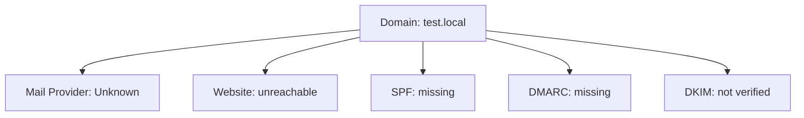

# Next-Gen-IT Audit Report

## Organization
- Name: Test Co
- Domain: test.local
- Security score: 5/100

## Snapshot
- Mail provider: Unknown
- Website status: unreachable
- MX records: none detected
- SPF: missing
- DMARC: missing
- DKIM selectors found: none

## Findings

### [HIGH] No MX records detected
- Category: mail
- Code: NO_MX
- Description: The domain does not expose MX records, so business email routing is unclear.
- Recommendation: Confirm the intended mail platform and publish valid MX records.
- Evidence: No MX records were returned from DNS.

### [HIGH] SPF record missing
- Category: security
- Code: SPF_MISSING
- Description: The domain does not publish an SPF record, which weakens sender validation.
- Recommendation: Publish an SPF record for the approved mail senders and use a restrictive policy.
- Evidence: No TXT record beginning with v=spf1 was found on the root domain.

### [CRITICAL] DMARC record missing
- Category: security
- Code: DMARC_MISSING
- Description: The domain does not publish DMARC, making spoofing detection and enforcement much weaker.
- Recommendation: Publish a DMARC record and begin with monitoring or quarantine before moving to reject.
- Evidence: No v=DMARC1 record was found at _dmarc.test.local.

### [MEDIUM] DKIM could not be publicly verified
- Category: security
- Code: DKIM_NOT_VERIFIED
- Description: No common DKIM selectors were discoverable, so outbound signing could not be confirmed.
- Recommendation: Confirm the mail provider's DKIM selectors and verify active signing.
- Evidence: Common selectors checked: google, selector1, selector2, default, k1, smtp

### [LOW] Website was not reachable during the scan
- Category: web
- Code: WEBSITE_UNREACHABLE
- Description: The public website could not be reached over HTTP or HTTPS during the audit.
- Recommendation: Confirm site availability and public access controls.
- Evidence: HTTP and HTTPS requests failed.

## Current-State Diagram

## Next best actions
1. Fix the highest-severity mail authentication findings first.
2. Confirm all legitimate senders before tightening SPF and DMARC.
3. Upload invoices, screenshots, or tool exports to expand this into a full ecosystem audit.
